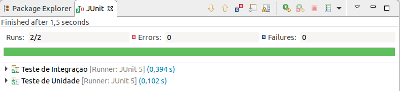

# springboot-junit-mockito
Mostra como usar JUnit 5 e Mockito 3 para Teste de Unidade e Teste de Integração com o Spring Boot 2.

-------------------
### Tecnologias:
- Spring Boot 2
- JUnit 5
- Mockito 3
